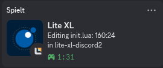

# Discord presence for lite-xl

This only works on Linux; if you're on something else, use [litepresence](https://github.com/TorchedSammy/litepresence).

This plugin displays what file you're editing and your directory in your Discord rich presence.



You can customize the RPC messages by setting `config.plugins.discord_rpc`. The default config looks like this:

```lua
enabled = true,
app_id = "749282810971291659",
edit_text = "Editing %f",
idle_text = "Idling in %f",
lower_edit_text = "in %w",
lower_idle_text = "Idling in %w",
edit_show_line_num = true,
idle_show_line_num = true,
show_elapsed_time = true,
idle_timeout = 30,
idle_show_logo = true,
reconnect = 5,
```

## Installing
#### Automatic
* run `lpm install discord-presence`
#### Manual
* make a folder called 'discord-presence' in `~/.config/lite-xl/plugins`
* copy `init.lua`, `discord.lua` there
* either build or download `discord_socket.so` and copy it there

## Explanation
**a simple discord-rpc implementation in C and lua**  
`main.c`, `include/discord.h`, and `discord.lua` comprise a basic implementation of `discord-rpc` from scratch. It's not feature-complete, but it is extensible.  
If you want to use it for a different project, all you have to do is make small changes to `main.c` to use the standard lua API instead of lite-xl's header, and link lua in compiling it.

## Thanks
to [vincens2005](https://github.com/vincens2005) for making [lite-xl-discord2](https://github.com/vincens2005/lite-xl-discord2), this fork's base.
